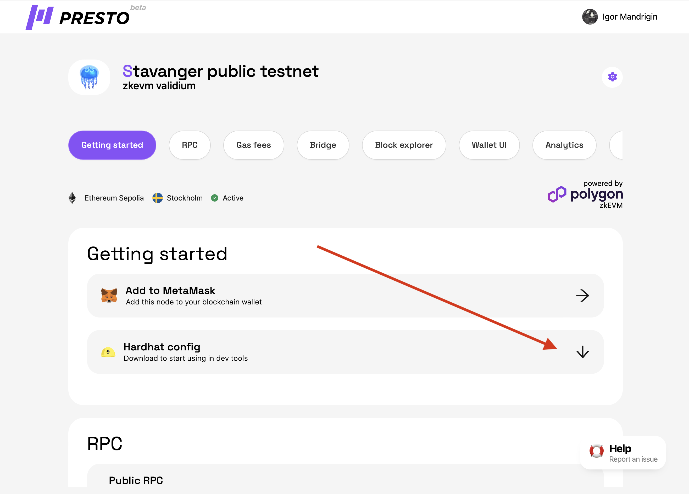

# How to use HardHat with Presto

To use HardHat with Presto and deploy a smart contract, follow these steps:

1. **Setup HardHat:**
   * Install HardHat globally by running `npm install -g hardhat`.
   * Create a new directory for your project and navigate into it.
   * Inside the project directory, run `npx hardhat init` to initialize a new HardHat project.
2. **Download Custom Config File:**
   * Visit the Presto website and download the custom config file for your specific network.
   * Save the config file in your project directory.
3.  **Configure HardHat:**

    * To provide HardHat with a command-line flag for a custom config and the network name, you can use the `--config` flag followed by the filename of the custom config file, and the `--network` flag followed by the network name.
    * For example, if you have a custom config file named `hardhat.config.ts` and the network name is `yourL2Name`, you can run the following command:

    ```
    npx hardhat --config hardhat.config.ts --network yourL2Name
    ```

    *   This command will run HardHat with the specified custom config file and connect to your L2 network.\


        <figure><figcaption></figcaption></figure>

4. **Add Private key to .env:**
5. **Add.env to .gitignore:**
6. **Write Your Smart Contract:**
   * Create a new Solidity file (e.g., `MyContract.sol`) in the `contracts` directory of your project.
   * Write your smart contract code in the Solidity file.
7. **Compile Your Smart Contract:**
   * In your project directory, run `npx hardhat compile` to compile your smart contract.
8. **Deploy Your Smart Contract:**
   * Write a deployment script in the `scripts` directory to deploy your smart contract.
   * Inside the deployment script, use the HardHat API to deploy your contract to the Presto network.
   * Run the deployment script by executing `npx hardhat run scripts/deploy.js` in your project directory.

Make sure to reference the HardHat and Presto documentation for more detailed information and additional configuration options.
