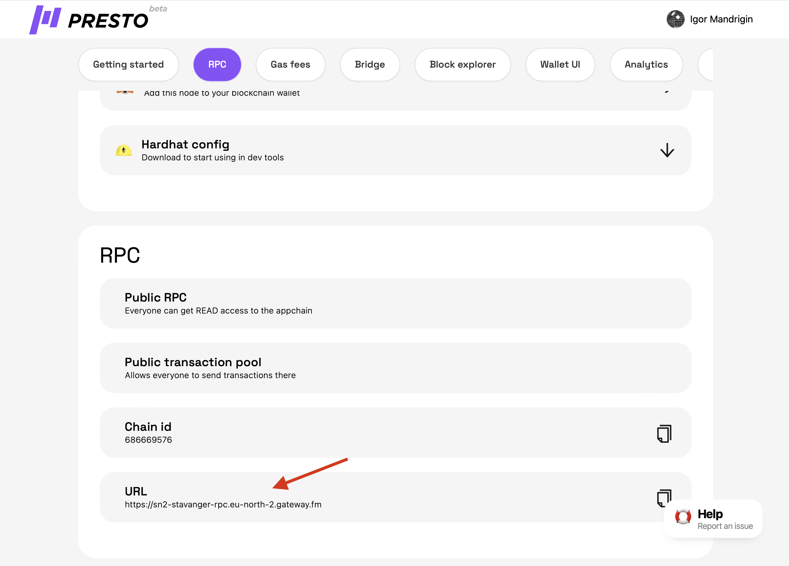

# How To Use Presto with web3.js

Using web3.js with a custom RPC endpoint allows you to interact with your Presto L2 and perform various operations on the network. You can retrieve information like the latest block number, check balance, and send transactions.

To use web3.js with a custom RPC endpoint, you can follow the steps below:

1. Install web3.js package:

```bash
npm install web3
```

2. Import web3.js into your project:

```jsx
const Web3 = require('web3');

```

3.  Create your rollup ([How to Create a Rollup](../main-functionality/how-to-create-a-rollup.md)), open it and get the RPC url ([What Is RPC](what-is-rpc.md))\


    <figure><figcaption></figcaption></figure>
4. Set up a custom RPC endpoint:

```jsx
const rpcEndpoint = '<RPC URL from the chain>'; // Replace with your custom RPC endpoint
const web3 = new Web3(rpcEndpoint);
```

5. Use web3.js methods to interact with your local geth node:

```jsx
// Get the latest block number
web3.eth.getBlockNumber()
    .then(blockNumber => {
        console.log('Latest Block Number:', blockNumber);
    })
    .catch(error => {
        console.error('Error:', error);
    });

// Get balance of an address
const address = '0x1234567890abcdef...'; // Replace with the desired address
web3.eth.getBalance(address)
    .then(balance => {
        console.log('Balance of', address + ':', balance);
    })
    .catch(error => {
        console.error('Error:', error);
    });

// Send a transaction
const from = '0x9876543210fedcba...'; // Replace with the sender's address
const to = '0xabcdef1234567890...'; // Replace with the recipient's address
const value = web3.utils.toWei('1', 'ether'); // Replace with the desired value
web3.eth.sendTransaction({ from, to, value })
    .then(transactionHash => {
        console.log('Transaction Hash:', transactionHash);
    })
    .catch(error => {
        console.error('Error:', error);
    });

```

Remember to replace the placeholders with your own values.
