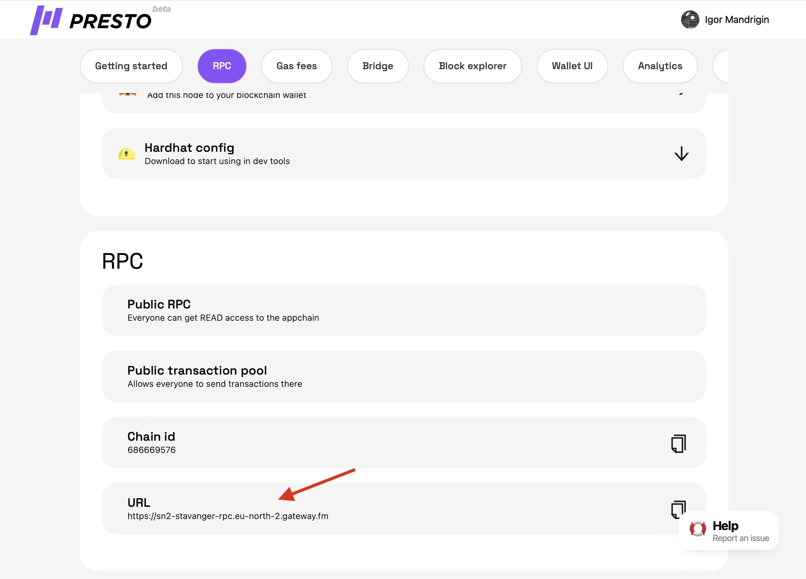

# How to use Presto with web3.py

1.  Create your rollup ([How to Create a Rollup](../main-functionality/how-to-create-a-rollup.md)), open it and get the RPC url ([What Is RPC](what-is-rpc.md))\


    <figure><figcaption></figcaption></figure>

```python
from web3 import Web3

presto = Web3(
    Web3.HTTPProvider(
        "<L2 RPC URL>"
    )
)
```
