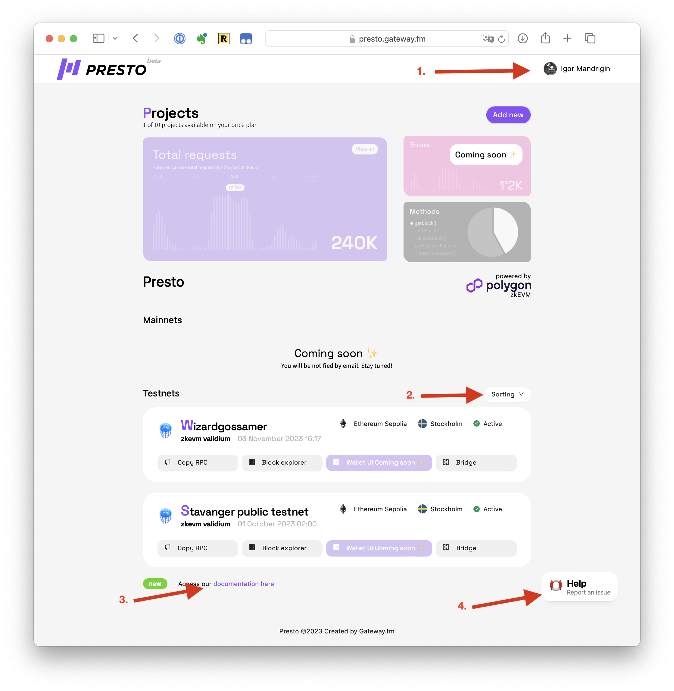

# ✨ Main Functionality


[how-to-create-a-rollup.md](how-to-create-a-rollup.md)


<figure><figcaption></figcaption></figure>

## Awesome Feature Two

Get amazing things done with awesome feature two. But remember that awesome feature one and three exist too. In fact, Awesome Product is full of awesome features.

