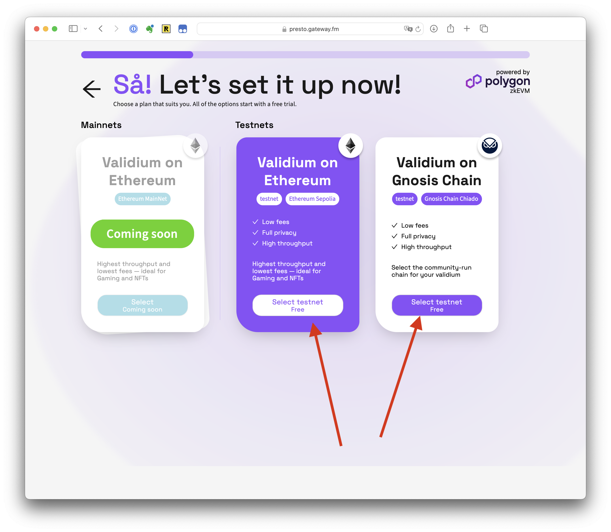

# How to Create a Rollup

This guide shows how to create a rollup on Ethereum or Gnosis Chain with the native gas token and the default gas fee marketplace:

* ETH for Ethereum
* xDAI for Gnosis Chain

## Steps

1. Login to [presto.gateway.fm](http://presto.gateway.fm) with your Google account
2.  Press “Add New”\

    <figure><figcaption></figcaption></figure>
3.  Select the rootchain to create L2 to. You can pick between Ethereum and Gnosis Chain.\

    <figure><figcaption></figcaption></figure>
4.  Select the location on where the nodes will be located.\
    \

    <figure><figcaption></figcaption></figure>
5.  Select if you want your users to pay gas (”Default Gas Token”) or not (”Gasless/No fees”).\

    <figure><figcaption></figcaption></figure>
6.  Press “Create” and see the success screen. In this screen you have two options. (1) sends to to the new rollup creation dashboard immediately. (2) sends you back to the list or projects.\

    <figure><figcaption></figcaption></figure>
7.  Wait for your rollup to be provisioned. Usually it takes about 6-7 minutes, but in the times of congestion it might take up to 24 hours.\
    \

    <figure><figcaption></figcaption></figure>

    <figure><figcaption></figcaption></figure>
8.  After the status of the rollup changed from “Provisioning” or “Deploying” to “Active”, you can use it.\

    <figure><figcaption></figcaption></figure>
9.  Done! Now you should see the full Dashboard and use your rollup!\

    <figure><figcaption></figcaption></figure>
