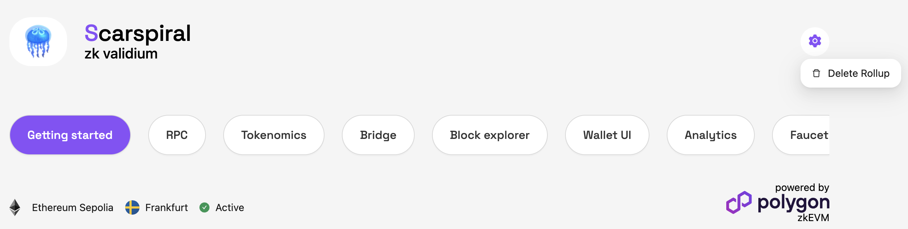

# How To Delete A Rollup

Rollup deletion is hidden behind the menu button on the right.

Click it and say “delete” in the dialog.\

<figure><figcaption></figcaption></figure>

<figure><figcaption></figcaption></figure>
