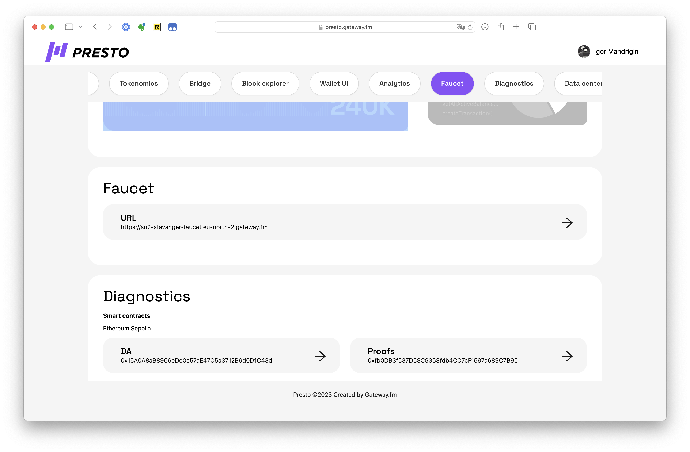
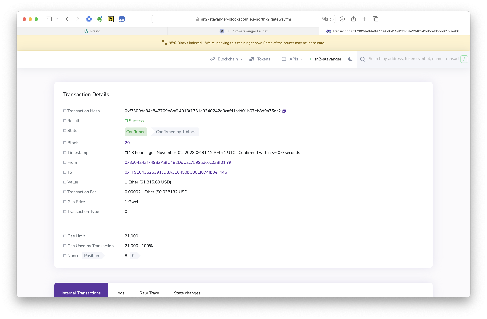

# How to use a Faucet

## How to use a Faucet


☝ Available only on testnets!


## What is a Faucet?

A faucet is a way to distribute test tokens for rollup customers to be able to deploy smart contracts, it is is not gasless. (see also [How To Deploy A Smart Contract](../features-for-developers/how-to-deploy-a-smart-contract.md), [How To Create & Use a Gasless Rollup).](how-to-create-and-use-a-gasless-rollup.md)

Each Testnet provisioned with Presto has a faucet built-in and pre-funded.

## How To Use a Faucet?

This shows to to request 1 test ETH on the faucet.

1.  Navigate to “**Faucet**” in the L2 Dashboard (see also [Presto L2 Dashboard](../presto-ui-dashboards/presto-l2-dashboard.md))\

    <figure><figcaption></figcaption></figure>
2.  Open Faucet, enter your wallet address and press “Request”\

    <figure><figcaption></figcaption></figure>
3.  Confirm on the block explorer and in the wallet (see [How To Use Metamask with Presto](how-to-use-metamask-with-presto.md), [How to use a Block Explorer](how-to-use-a-block-explorer.md))\

    <figure><figcaption></figcaption></figure>
