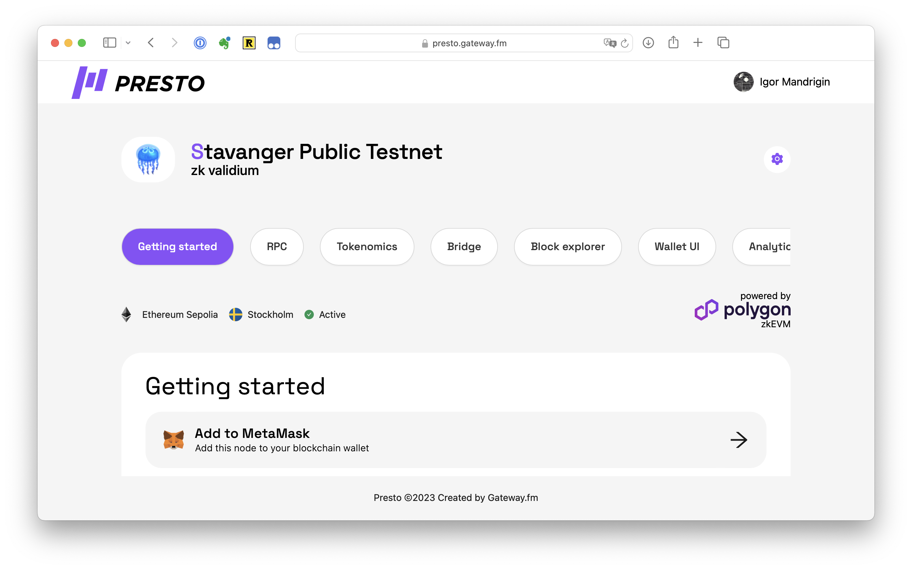
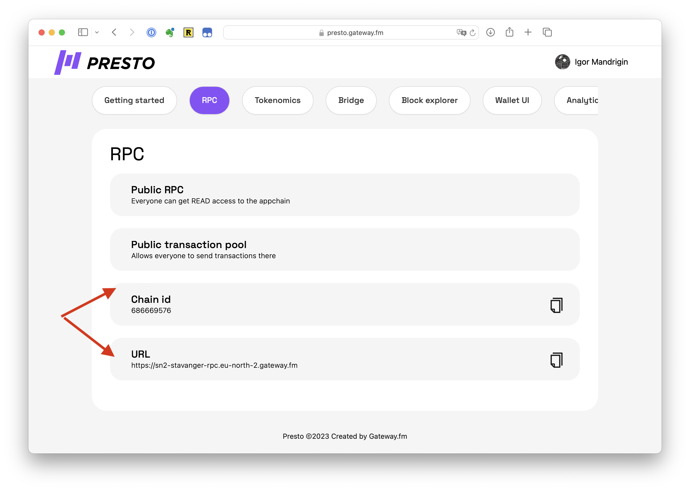
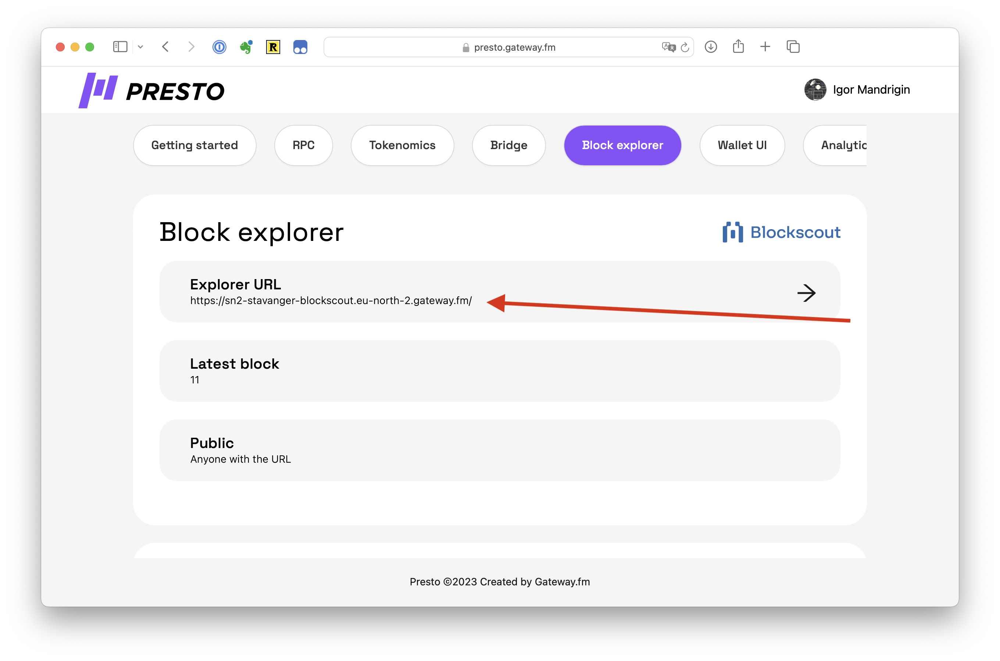

# How To Use Metamask with Presto

## How To Use Metamask with Presto

## Option 1: Use “Add to Metamask” button


☝ This also works for Brave and some other wallets.


1. Open your rollup dashboard from the list of projects (see [Presto List Of Projects](../presto-ui-dashboards/presto-list-of-projects.md), [Presto L2 Dashboard](../presto-ui-dashboards/presto-l2-dashboard.md))
2.  Press “Add To Metamask” button.\

    <figure><figcaption></figcaption></figure>

## Option 2: Add Manually

1. Open your rollup dashboard from the list of projects (see [Presto List Of Projects](../presto-ui-dashboards/presto-list-of-projects.md), [Presto L2 Dashboard](../presto-ui-dashboards/presto-l2-dashboard.md))
2.  From the **RPC section**, you can find Chain ID and RPC URL\

    <figure><figcaption></figcaption></figure>
3.  From the “**Block Explorer**” section, copy “Explorer URL”\

    <figure><figcaption></figcaption></figure>
