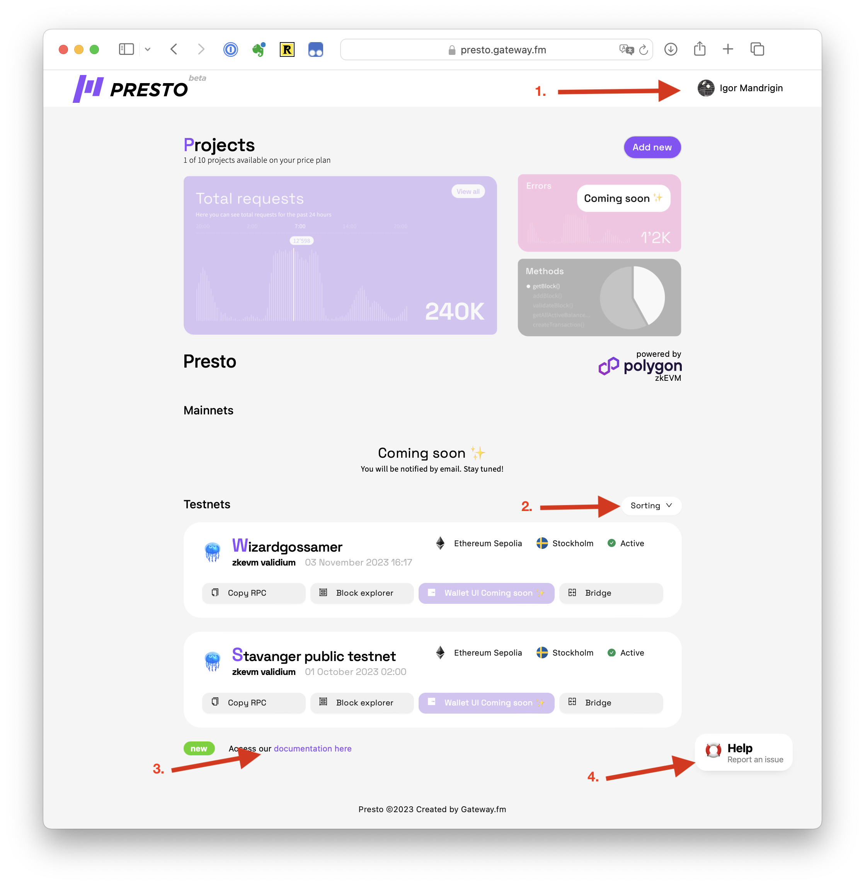

# Presto List Of Projects

## Presto List Of Projects

## Full UI

<figure><figcaption></figcaption></figure>

1. Username and logout menu
2. Sorting menu
3. Documentation
4. Help & Support menu — contact us, Discord and docs.

## Entry

Click on this entry opens the L2 dashboard (see [Presto L2 Dashboard](https://www.notion.so/Presto-L2-Dashboard-f3613e23ecc54bee854104ae6aee9f4d?pvs=21))\
\

1. Name of the L2
2. Date/time of creation
3. Root chain (L1)
4. Region where the nodes are located
5. Status (active/pending/provisioning/issues)
6. Directly copy RPC URLs to clipboard ([What Is RPC](https://www.notion.so/What-Is-RPC-094669c329814c6a92d7acbae84d5d3c?pvs=21))
7. Jump to the block explorer ([How to use a Block Explorer](https://www.notion.so/How-to-use-a-Block-Explorer-b822b1fab0f143cb88898bb1818d1920?pvs=21))
8. Jump to the bridge ([How to Use a Bridge](https://www.notion.so/How-to-Use-a-Bridge-ef40695e1c8a4c58a9bdbb03971617a4?pvs=21))
